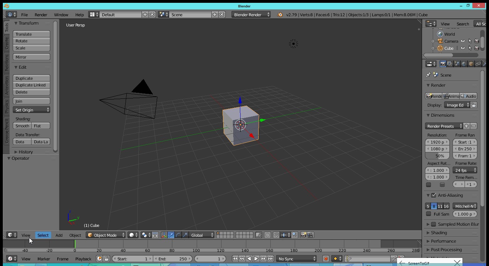

# About

Blender AddOn : Save all the settings under the 3D View Display Properties Panel

## Change Log

* [0.1.0 - Prototype](https://github.com/iluvblender/addon_preset_view3d_properties_display/releases/tag/0.1.0)

# Usage

Install the addon file view3d_props_display_presets.py and then enable it.

